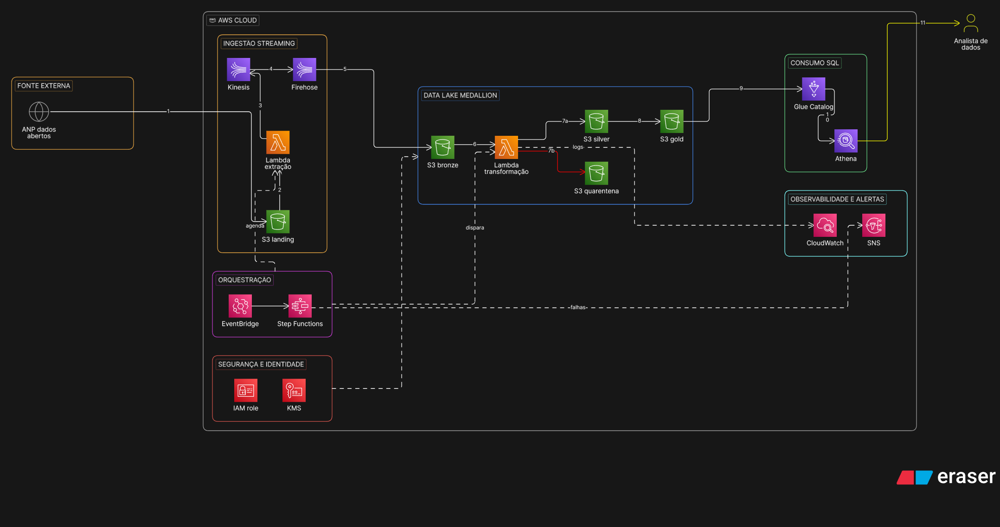

# Event lakehouse on local AWS (Floci)

A Medallion-style data pipeline (bronze / silver / gold) built on AWS services
emulated locally with [Floci](https://github.com/floci-io/floci): no AWS account, no cost.



> Diagram source: `docs/architecture.eraserdiagram` (Eraser diagram-as-code).

## Data flow

1. The ANP CSV is uploaded to the S3 landing bucket
2. The extraction Lambda reads the file in chunks (with optional fault injection)
3. and publishes the events to Kinesis
4. Firehose buffers them
5. and delivers to S3 bronze (raw)
6. The transformation Lambda validates each record
7. a) valid records go to S3 silver; b) invalid ones go to S3 quarantine
8. Silver is aggregated into gold _(not implemented yet)_
9. Glue Data Catalog registers the tables _(not implemented yet)_
10. Athena queries gold with SQL
11. The analyst consumes the results

EventBridge Scheduler starts a Step Functions state machine that loops the extraction
(one chunk per Lambda call), waits for Firehose to flush, runs the transformation and
sends an SNS alert on failure. CloudWatch collects logs and metrics.

## Data source

Public open data from ANP (Brazil's oil & gas regulator), monthly production per well.
Download the CSV from the ANP open-data pages and check the terms of use before publishing.
The data is monthly/batch, so the pipeline **replays** it as a stream.
Clean public data rarely exercises validation, so the extraction step can inject faults
(duplicates, late events, missing fields, invalid or negative numbers) via `fault_rate`.

## Quickstart

```bash
docker compose up -d                 # start Floci on :4566
pip install -r requirements.txt
bash scripts/bootstrap.sh            # create buckets, stream, Lambdas, state machine, schedule...
export PYTHONPATH=src
pytest                               # unit tests (no Floci needed)

# upload the sample (or the real ANP file, then edit "key" in infra/execution-input.json)
aws s3 cp data/sample/anp_sample.csv s3://lakehouse-landing/anp/

# run the whole pipeline once
aws stepfunctions start-execution \
  --state-machine-arn arn:aws:states:us-east-1:000000000000:stateMachine:lakehouse-pipeline \
  --input file://infra/execution-input.json

# or, without Lambdas: try the producer locally
python -m lakehouse.producer --csv data/sample/anp_sample.csv --dry-run --fault-rate 0.3
```

`data/sample/anp_sample.csv` is a tiny sample for tests (one row from the ANP metadata example, the rest made up).

## Design decisions

| Decision | Why |
|---|---|
| Landing bucket + extraction Lambda | The whole ETL runs inside AWS; the source is the only external piece |
| One chunk per Lambda call, looped by Step Functions | Fits Lambda time limits and makes progress visible in the state machine |
| Deterministic `event_id` (hash of the row) | Makes duplicates detectable across replays |
| Deterministic faults per chunk (seeded) | A retried chunk repeats the same events |
| Raw row kept in bronze, canonical schema built in silver | Bronze stays a faithful copy of the source |
| Alias table for column names (`schema.py`) | ANP files differ in columns and units |
| Quarantine bucket instead of dropping bad rows | Failures are visible and reprocessable |
| Fixed 90 s wait before transforming | Firehose buffers before writing to S3 (a sensor/trigger would be better) |

## What is different on real AWS

_TODO: IAM policies, VPC/networking, service limits, Firehose buffering, Athena cost per TB scanned, Glue ETL (Spark)._

## Roadmap

- [ ] Gold aggregation job (silver -> gold)
- [ ] Write silver/gold as Parquet
- [ ] Register Glue tables and query gold from Athena
- [ ] Replace the fixed Firehose wait with an S3-event or polling check
- [ ] Byte-offset reading in the extraction Lambda for very large files
- [ ] Cross-file deduplication
- [ ] Terraform/CDK instead of the bootstrap script
- [ ] GitHub Actions: start Floci and run an end-to-end test
# floci-aws-lakehouse
